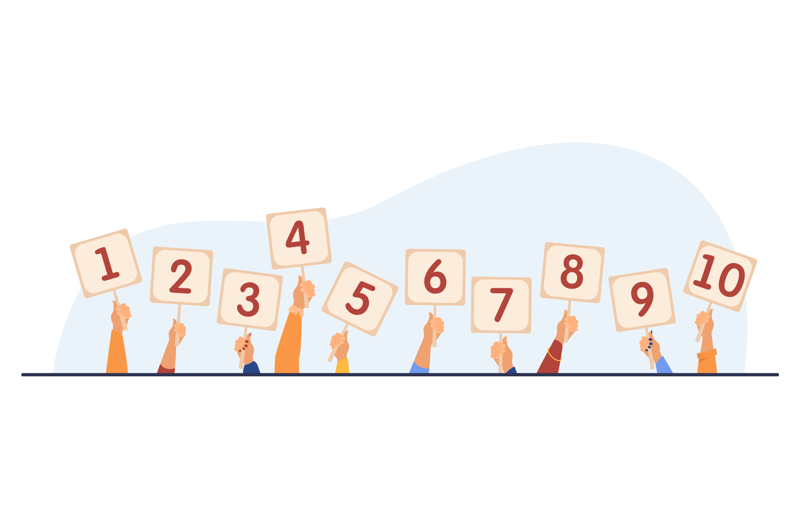

# 🎮 Nombre Mystère - Plus qu'un simple jeu de devinette

<div align="center">
  
  
  [](https://developer.mozilla.org/en-US/docs/Web/HTML)
  [](https://developer.mozilla.org/en-US/docs/Web/CSS)
  [](https://developer.mozilla.org/en-US/docs/Web/JavaScript)
  [](https://getbootstrap.com/)
</div>

## 📋 Table des matières

- [À propos](#-à-propos)
- [Fonctionnalités](#-fonctionnalités)
- [Easter Eggs](#-easter-eggs--éléments-cachés)
- [Technologies](#-technologies-utilisées)
- [Installation](#-installation)
- [Comment jouer](#-comment-jouer)
- [Structure du projet](#-structure-du-projet)
- [Auteur](#-auteur)

## 🎯 À propos

**Nombre Mystère** est bien plus qu'un simple jeu de devinette. Sous son apparence classique se cache un univers cyberpunk avec des effets Matrix, des messages secrets et même un mini-jeu Snake caché !

Développé dans le cadre d'une formation en développement web, ce projet démontre la maîtrise des interactions JavaScript/DOM tout en offrant une expérience utilisateur surprenante et immersive.

### 🎮 Démo en ligne

[Jouer maintenant](https://votre-username.github.io/nombre-mystere/) *(Remplacez par votre lien)*

## ✨ Fonctionnalités

### 🎲 Fonctionnalités principales

- **3 niveaux de difficulté** :
  - 🟢 **Facile** : Devinez entre 1 et 10 (3 essais)
  - 🟡 **Moyen** : Devinez entre 1 et 50 (2 essais)
  - 🔴 **Difficile** : Devinez entre 1 et 100 (1 essai)

- **Système d'indices** : "C'est plus !" ou "C'est moins !" après chaque tentative
- **Effets sonores** : Sons de victoire, défaite, clic et erreur
- **Animations visuelles** :
  - Explosion d'émojis 🎉💥
  - Effet de chargement Matrix
  - Titre avec effet glitch animé
  - Boutons avec ondulation au survol

- **Interface responsive** : Compatible desktop, tablette et mobile

### 🔥 Fonctionnalités avancées

- **Effet Matrix permanent** : Des chiffres verts défilent en arrière-plan
- **Validation robuste** : Gestion des erreurs de saisie avec feedback visuel
- **Animations de transition** : Délai d'1 seconde avant l'affichage du résultat
- **Mode "Rejouer"** : Relancez instantanément une nouvelle partie

## 🐍 Easter Eggs & Éléments cachés

### 1. 💬 Message mystérieux

Un message caché apparaît aléatoirement : *"Avez-vous trouvé le serpent caché ?"*

- Apparition entre 5 et 15 secondes
- Reste visible 3 secondes puis disparaît
- Position aléatoire sur l'écran

### 2. 🐍 Mini-jeu Snake secret

**Comment le débloquer :**

1. Faites **5 erreurs de saisie** consécutives (nombres invalides)
2. Après 3 erreurs, un emoji serpent 🐍 apparaît en bas à droite
3. Après 5 erreurs, le mini-jeu Snake se révèle !

**Caractéristiques du Snake :**

- Canvas de 400x400 pixels
- Contrôles : Flèches directionnelles
- Nourriture rouge à collecter
- Game Over si collision avec les murs ou soi-même
- Design rétro sur fond noir

### 3. 🎨 Effets visuels cachés

- **Effet shake** : Le bouton tremble lors d'une erreur de saisie
- **Pulsation** : Animation sur les messages de victoire
- **Gradient animé** : Le titre change de couleur en permanence

## 🛠 Technologies utilisées

- **HTML5** : Structure sémantique
- **CSS3** : Animations avancées, effets visuels, responsive design
- **JavaScript ES6+** : Logique du jeu, gestion d'événements, DOM manipulation
- **Bootstrap 5** : Framework CSS pour une interface moderne
- **Google Fonts** : Police Poppins pour une meilleure lisibilité
- **Canvas API** : Pour le mini-jeu Snake

## 📦 Installation

1. **Clonez le repository**

```bash
git clone https://github.com/votre-username/nombre-mystere.git
cd nombre-mystere
```

2. **Structure des fichiers**

```
nombre-mystere/
├── index.html          # Page principale
├── style.css           # Styles et animations
├── script.js           # Logique du jeu
├── README.md           # Documentation
├── images/            
│   └── mystery-number.svg
└── sons/               # Effets sonores
    ├── bravo.mp3
    ├── bhou.mp3
    ├── click.mp3
    └── error.mp3
```

3. **Lancement**

- Ouvrez simplement `index.html` dans votre navigateur
- Ou utilisez un serveur local : `python -m http.server 8000`

## 🎮 Comment jouer

### Jeu principal

1. Choisissez votre niveau de difficulté
2. Entrez un nombre dans la plage indiquée
3. Cliquez sur "Valider"
4. Suivez les indices pour ajuster votre prochaine tentative
5. Trouvez le nombre mystère avant d'épuiser vos essais !

### Mini-jeu Snake (caché)

1. Déclenchez-le avec 5 erreurs de saisie
2. Utilisez les flèches pour diriger le serpent
3. Mangez la nourriture rouge
4. Évitez les murs et votre propre queue

## 📁 Structure du projet

```javascript
// Principales fonctions JavaScript

initGame(level)          // Initialise une nouvelle partie
generateMysteryNumber()  // Génère le nombre à deviner
setRangeAndAttempts()   // Configure la difficulté
createMatrixEffect()    // Effet Matrix en arrière-plan
createEmojiExplosion()  // Animation de victoire/défaite
showHiddenMessage()     // Affiche le message secret
startSnakeGame()        // Lance le mini-jeu caché
```

## 🏆 Points forts du projet

- **Innovation** : Transformation d'un exercice classique en expérience immersive
- **Créativité** : Univers cyberpunk cohérent avec effets Matrix
- **Technique** : Maîtrise avancée de JavaScript et des animations CSS
- **Surprise** : Easter eggs qui enrichissent l'expérience
- **Polish** : Attention aux détails (sons, animations, messages)

## 👨‍💻 Auteur

- **RetroGreg** - [GitHub](https://github.com/RetroGreg)
- Développé dans le cadre de la formation DWWM

---

<div align="center">
  <p>Fait avec ❤️ et beaucoup de ☕</p>
  <p><strong>Avez-vous trouvé tous les secrets ? 🐍</strong></p>
</div>
